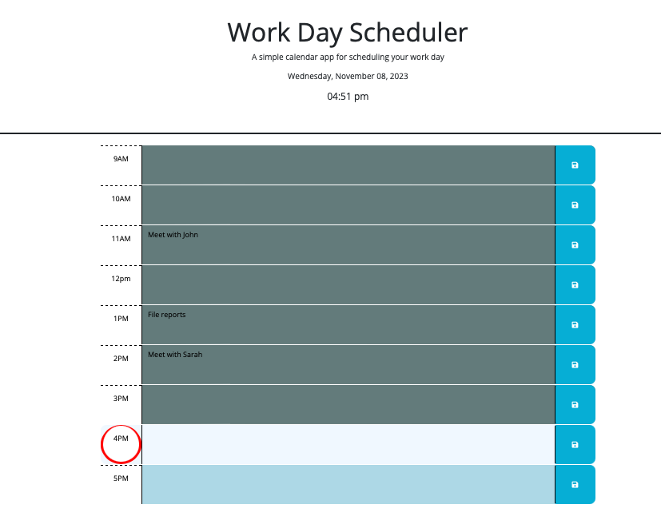

# Work Day Planner

## Description

A simple calendar application that allows someone to save events in the typical 9-5 hour work day.
The calendar keeps track of the current event, past events, and future events.

## Usage

To use this calendar, open it in a browser and see the 8 hour work day. In any of the time blocks fill out your schedule for the day and hit the save button to the right.

## Credits / References

JQuery and DayJs:
https://learn.jquery.com/using-jquery-core/document-ready/#:~:text=Using%20jQuery%20Core-,%24(%20document%20).ready(),for%20JavaScript%20code%20to%20execute.

https://www.w3docs.com/snippets/javascript/how-to-get-the-current-date-and-time-in-javascript.html#how-to-get-the-current-date-2

https://day.js.org/docs/en/parse/string-format

https://www.w3schools.com/jsref/jsref_parseint.asp

https://www.w3schools.com/jsref/jsref_split.asp#:~:text=The%20split()%20method%20splits,string%20is%20split%20between%20words.

https://api.jquery.com/find/

Local storage:
https://developer.mozilla.org/en-US/docs/Web/API/Window/localStorage